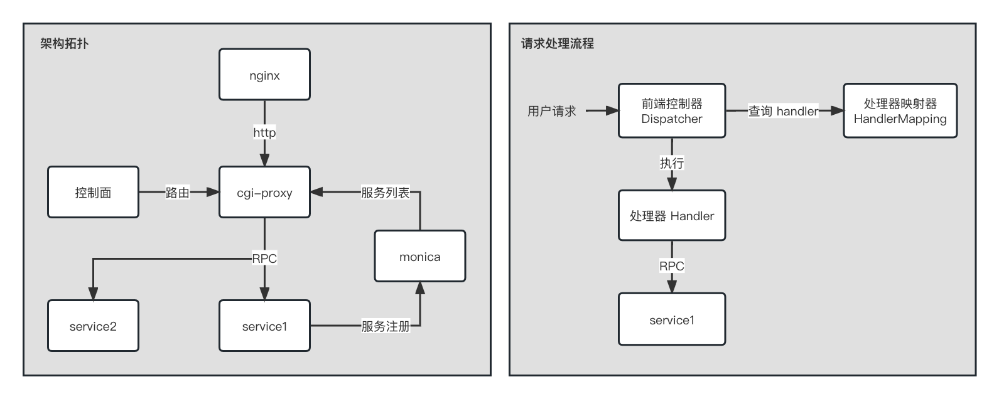

## gRPC CGI Proxy

**gRPC CGI Proxy** 是 gRPC 服务透明代理解决方案.



### Running

```shell
go run main.go
```

在服务启动前，请先确保下列依赖服务已经在本地安装且可以正常访问：

- [Monica 服务注册中心](https://github.com/ZuoFuhong/monica)

### 动态路由支持

当前使用静态配置文件指定下游服务，后续可以通过 **控制面** 动态配置服务路由:

```json
[
    {
      "service_name": "go_wallet_manage_svr",
      "namespace": "Production",
      "desc": "钱包服务",
      "methods": [
        {
          "cgi_path": "/cgi-proxy/create_wallet",
          "method": "GET",
          "desc": "创建钱包",
          "cmd": "CreateWallet",
          "timeout": 1000
        },
        {
          "cgi_path": "/cgi-proxy/import_wallet",
          "method": "POST",
          "desc": "导入钱包",
          "cmd": "ImportWallet",
          "timeout": 1000
        }
      ]
    }
]
```

### 接口测试用例

```shell
curl --location --request POST 'http://127.0.0.1:8081/cgi-proxy/import_wallet' \
--header 'Content-Type: application/json' \
--data '{
    "private_key": "0x01c4bda0939df07a31e3738c6c1e1d5905c9f229e6ffa1922557308a62efb23f"
}'
```

```shell
curl --location --request POST 'http://127.0.0.1:8081/cgi-proxy/import_wallet' \
--header 'Content-Type: application/x-www-form-urlencoded' \
--data-urlencode 'private_key=0xf1feee1a38a42bc46fd05bebcc0fa17d6b35446349863e01c8db4c65603f3725'
```

## License

This project is licensed under the [Apache 2.0 license](https://github.com/ZuoFuhong/grpc-cgi-proxy/blob/master/LICENSE).